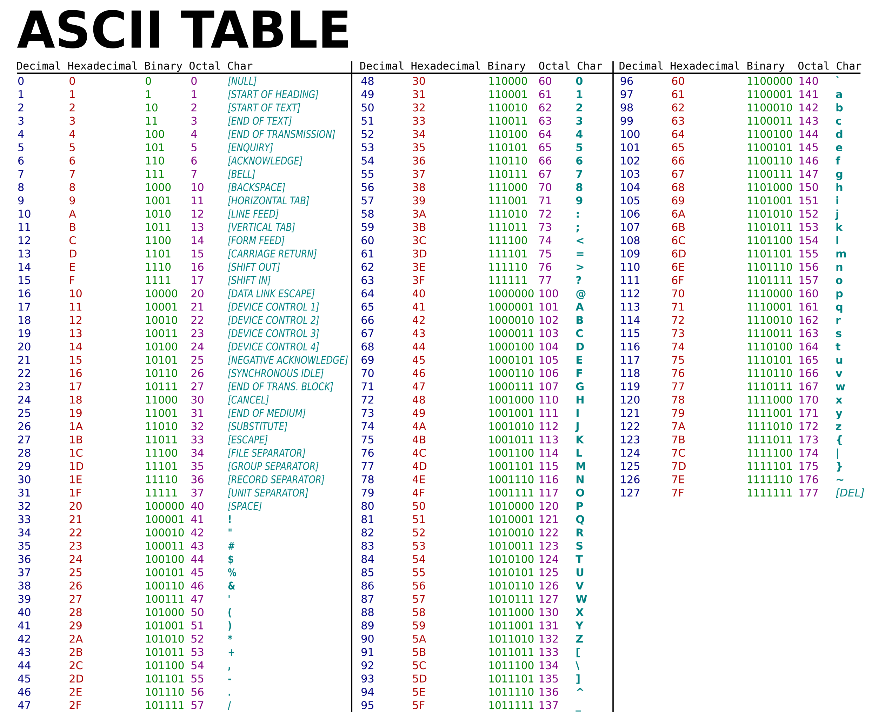

## String manipulation

### Convert char to int

```c++
int i = c - '0';
```

### Convert number to string

```c++
string s = to_string(x);
```

### Convert number to binary string

```c++
string to_binary(int n) {
    string result;
    while (n > 0) {
        result = char((n % 2) + '0') + result;
        n /= 2;
    }
    return result.empty() ? "0" : result;
}
```

### To upper and to lower case

```c++
transform(s.begin(), s.end(), s.begin(), ::toupper);
transform(s.begin(), s.end(), s.begin(), ::tolower);
```

### Substrings

```c++
// From i to the end
string a = s.substr(i);
// From i to j
string a = s.substr(i,j);
```

### Find a char

Print the position.

```c++
int l = s.find(c);
```

If not found.

```c++
if( s.find(c) != string::npos ){
    // YES
} else {
    // NO
}
```

### Substrings with steroids

This is a way to extract the values from a string that has a specific format. For example, if the string is "1:2,3" and we want to extract the values 1, 2 and 3.

```c++
int a;
int b;
int c;
char comma;
char colon;

// Createa a stringstream object
stringstream ss(fullString);
// Extract the strings
ss >> a >> colon >> b >> comma >> c;
```

### Stringstream to string

Some times its easier to use a stringstream to convert between strings and other types.

```c++
stringstream ss;
ss << value1 << value2;
return ss.str();
```

### Create a string that repeats a character

```c++
char c = 'a';
int n = 5;
string result(n, c);
return result;
```

### ASCII table

